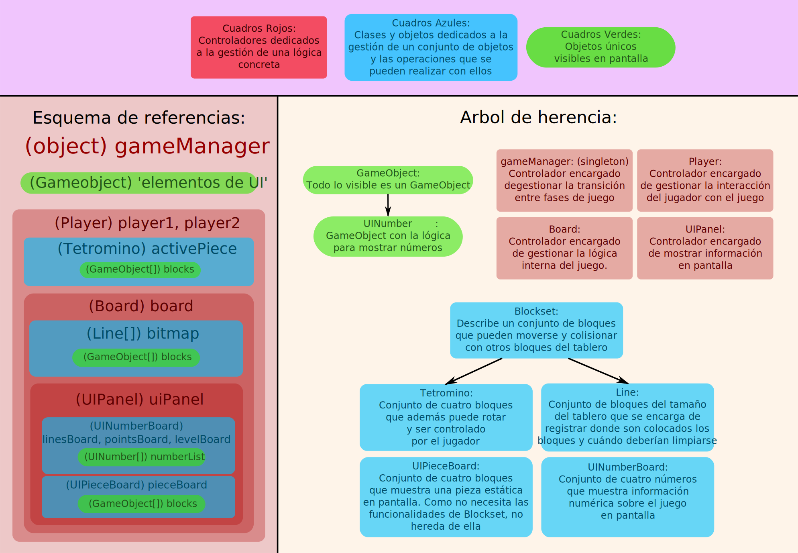

# Informe Técnico
En este informe se pretende demostrar los conocimientos en el lenguaje y el paradigma de Programación Orientada a Objetos del equipo.  

## Esquemas visuales:
Para facilitar la comprensión del código se realizaron unos esquemas que representan las 
estructuras utilizadas en el desarrollo del proyecto.  

En el esquema de referencias se puede ver cómo estan anidadas las diferentes estructuras que se explican en el arbol de herencia.  
Entre parentesis se señala la clase a la que pertenece la instancia del objeto y el nombre en camelCase es la referencia en el código.  

>#### Nota sobre object:
>Es relevante mencionar la estructura *"object"*, que no es más que la funcionalidad provista por el lenguaje para crear objetos autodefinidos estáticos, de ámbito semi-global (global una vez importado) que se usaron para cubrir varias funciones que se detallarán más adelante. 

<br>


## Términos, patrones y estructuras:
Para expandir en la explicación técnica del proyecto, se mostrarán diferentes porciones del código que aplican (o al menos pretenden aplicar) diferentes conceptos del paradigma, junto con una explicación del concepto y por qué fue aplicado.

### Sección "Programación Orientada a Objetos":
#### Polimorfismo:
El polimorfismo refiere a la capacidad de varios objetos de poder responder al mismo mensaje de formas distintas. Cuando en un conjunto de objetos, todos implementan la capacidad de recibir un mensaje sin respetar una igualdad en la implementación, se dice que ese mensaje es *polimórfico* y que los objetos que lo implementan son *polimórficos*.

Un ejemplo de esto en nuestro código es la función *"move()"* que implementan GameObject y Tetromino:

```php
// classes.wlk/5
class GameObject
{
  // {...}
  
  // classes.wlk/11
  method move(deltaX, deltaY) {
    position = game.at(position.x() + deltaX.coerceToInteger(), position.y() + deltaY.coerceToInteger())
  }

  // {...}
}

// classes.wlk/73
class Tetromino
{
  // {...}
  
  // classes.wlk/95
  method move(deltaX, deltaY) {
    if(self.preMoveChecks(deltaX, deltaY)) { return }

    self.moveAll(deltaX, deltaY)

    return
  }

  // {...}
}
```
#### Herencia:
La herencia refiere a la capacidad de una "clase hija" de adoptar las implementaciones de otra clase, que pasa a ser su "clase padre". Esto permite extender el comportamiento genérico de una clase a otras clases que adaptan ese comportamiento a sus necesidades particulares.

En el arbol de herencia se puede visualizar mucho mejor los casos de herencia en el proyecto, pero el ejemplo más fácil de comprender es el de *Blockset* siendo la clase padre de *Tetromino* y *Line*.

```php
// constants.wlk/27
class BlockSet
{
  // {...}
}

// constants.wlk/73
class Tetromino inherits Blockset {
  // {...}
}

// constants.wlk/194
class Line inherits Blockset {
  // {...}
}
```
#### Clase Abstracta:
Se llama "clase abstracta" a una clase que nunca se instancia. La clase Blockset mencionada justo arriba es un ejemplo de nuestro proyecto de una clase abstracta.

-------------

### Sección *object*:
El anteriormente mencionado *"object"* fue utilizado aprovechando su gran versatilidad para cubrir múltiples funciones a lo largo del código.  
Para entender a qué nos referimos, vamos a mencionar sus casos de  uso:


#### "Carpetas"
Es muy común durante el desarrollo de un programa utilizar archivos dedicados a almacenar referencias centralizadas de valores constantes, configuraciones y más información que se referenciará en múltiples lugares a lo largo del resto del proyecto.
Al concepto de usar un objeto para almacenar una colección de constantes es a lo que llamamos "*carpeta*". Todos los ejemplos de la carpeta de constantes se hayan en el archivo *constants.wlk*. 

Un ejemplo fácil de entender es el *object* "keybinds", que almacena las referencias de teclado para los controles de ambos jugadores:

```php
// constants.wlk/129
object keybinds {
  const property wasd = object
  {
    const property up = keyboard.w()
    const property down = keyboard.s()
    const property left = keyboard.a()
    const property right = keyboard.d()
  }

  const property arrows = object
  {
    const property up = keyboard.up()
    const property down = keyboard.down()
    const property left = keyboard.left()
    const property right = keyboard.right()
  }
}
```

También existe el caso de las "carpetas" de métodos, comunmente conocidas como "bibliotecas" o "libraries":

```php
// constants.wlk/1
object utils {
  method random(min, max) = (min - 1).randomUpTo(max).roundUp()

  method vectorSum(v1, v2) = game.at(v1.x() + v2.x(), v1.y() + v2.y())

  method v2ToString(v) = "(" + v.x().toString() + ";" + v.y().toString() + ")"

  method xyToString(x,y) = self.v2ToString(game.at(x,y))

  method numberToArray(number) {
    const stringArray = number.toString().split("")
    const numberArray = []
    stringArray.forEach({ char => numberArray.add(self.charToInt(char)) })
    
    return numberArray.reverse()
  }
}
```

-------

#### Controladores globales:
Los controladores globales son objetos dedicados a la gestión de una única lógica que afecta al juego en su totalidad. La cualidad de *object* les permite ser accedidos y llamados desde cualquier sección del proyecto. Son (por naturaleza del *object*) una buena representación del patrón **Singleton**, caracterizado por este comportamiento de objeto único dedicado al control de una lógica específica.

Un ejemplo de este caso de uso es el propio gameManager encargado del flujo entre estados de juego.  
Pero para evitar una cita de código gigantesca, se citará una porción recortada del mismo donde solo pueden verse los nombres de los métodos implementados. Resulta evidente la temática del objeto implicada por los nombres de los métodos:

```php
// gameManager.wlk
object gameManager {
  method start() {}

  method configGame() {}

  method removeAllVisuals() {}
  
  method toogleMultiplayer() {}

  method startMainMenu() {}

  method removeMainMenu() {}

  method tooglePause() {}

  method startMainGame() {}

  method onPlayerLost() {}

  method startGameOver() {}

  method endGameOver() {}
}
```